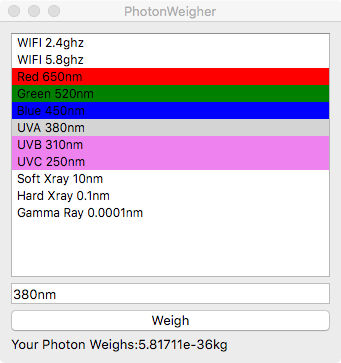

# PhotonWeigher

If I got anything wrong feel free to submit an issue, this was just a side project but its so small it wont be hard to maintain.  
This only applies if the photon is trapped, or it will just fly away at the speed of light.  
No, I dident actually catch and weigh these photons, I just used the precalculated weight of an electron volt * electron volts of the wavelength.
